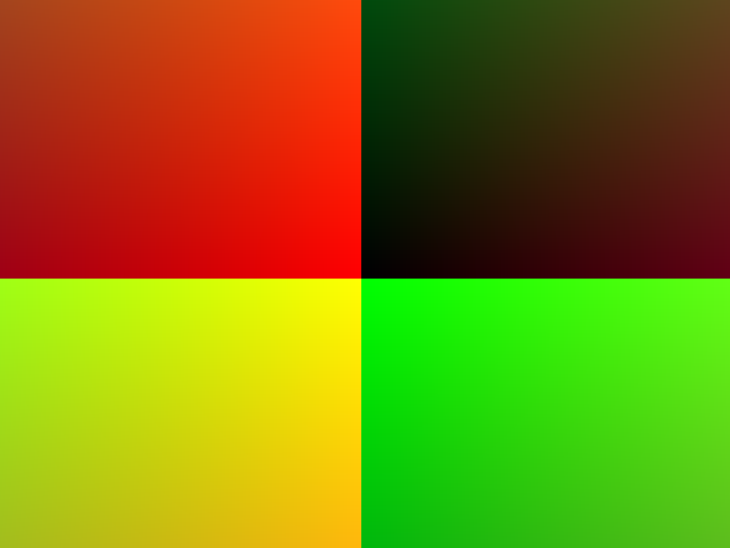
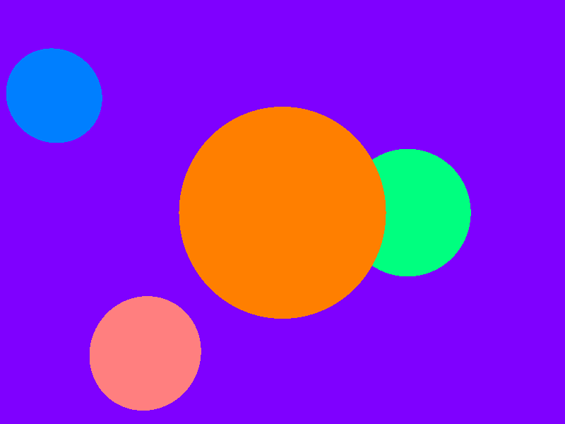
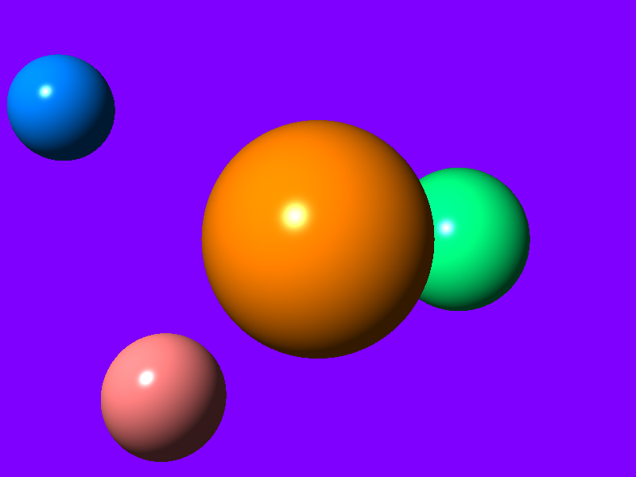
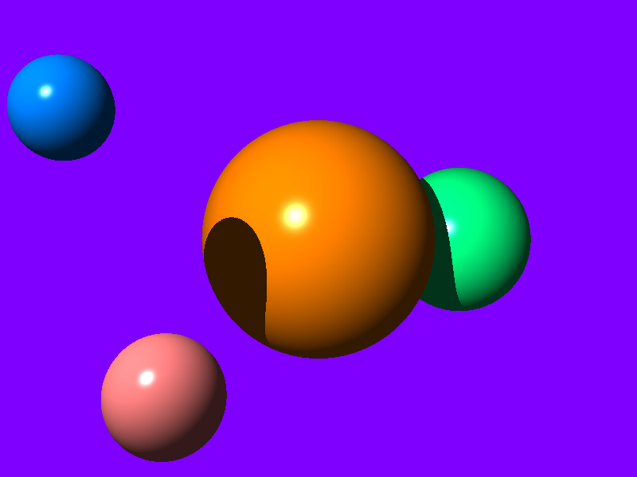
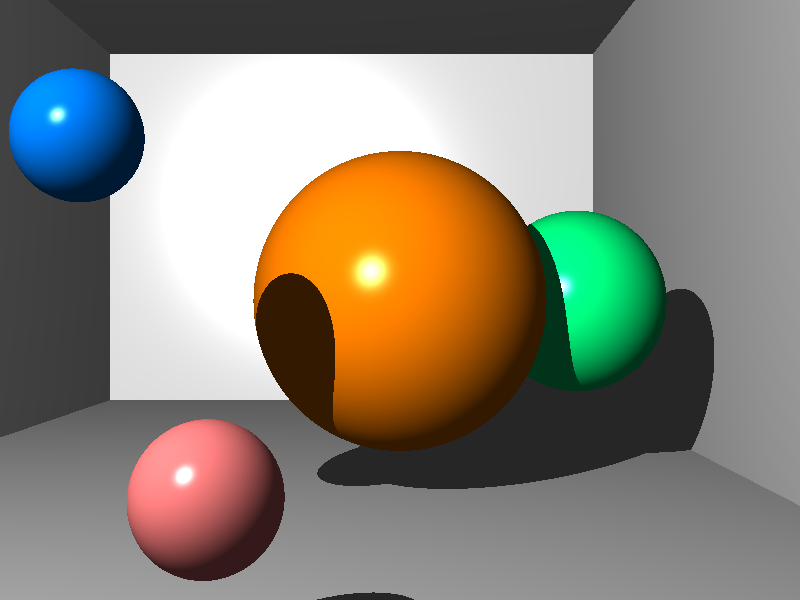
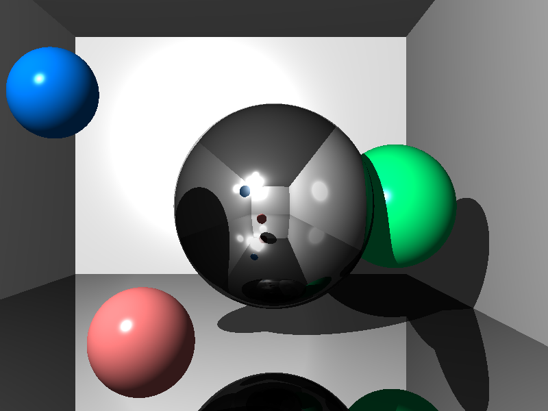

# CS-GY 6533 A / CS-UY 4533 - Interactive Computer Graphics - Fall 2022

_________________

**IMPORTANT: The code skeleton that you get in your GitHub classroom repo has two errors (it will compile fine when using Visual Studio, since it is very permissive, but it will throw compilation errors when using GCC). The version here in the ``code`` folder is correct, please have a look at it and change your code accordingly! Sorry for the inconvenience (there is unfortunately no easy way for me to make updates to your classroom repos). **

Here is a description of the two fixes:
* ``raytracer.cpp``, line 58: ``return writeP6PPM(unsigned int(dimx), unsigned int(dimy), image);`` needs to be replaced by ``return writeP6PPM((unsigned int)dimx, (unsigned int)dimy, image);``
* ``object.h``, line 18: ``virtual float intersect(const glm::vec3& rayOrigin, const glm::vec3& rayDir, glm::vec3& intersectPos = glm::vec3(0), glm::vec3& normal = glm::vec3(0)) = 0;`` needs to be replaced by ``	virtual float intersect(const glm::vec3& rayOrigin, const glm::vec3& rayDir, glm::vec3& intersectPos, glm::vec3& normal) = 0;``

_________________

# Assignment 2: Ray Tracer

Handout date: 09/25/2022

Submission deadline: 10/09/2022, 11:59PM EST

Demo date: TBA, via Zoom appointments

This assignment accounts for 20\% of your final grade. 

## Goals

The goal of this assignment is to implement a simple ray tracer in C++ that can render 3D scenes consisting of two different shapes (spheres and planes). The results will be written to a PPM image file and can be viewed offline.

## Submission

* Follow the link (to be sent by email) to create your repository.

* Add a README.md in markdown format as a report of what you did containing a screenshot for each task

* Push the code into the repository before deadline

## Tasks

We advise all non-private questions be posted on the class Discord channel, as reference for all students.
For other questions, please email us or join us on the office hours.

### Mandatory Tasks

For each of the tasks below, add at least one image in the readme demonstrating the results (and the intermediate results, if explicitly mentioned). 

The code that you used for all tasks has to be provided.

For this assignment, we provide a minimal code framework that uses CMAKE and includes the [GLM](https://github.com/g-truc/glm) library as an external resource (see folder ``code`` - **the same code should also be in your GitHub classroom repository once you have cloned it**). OpenGL Mathematics (GLM) is a header only C++ mathematics library for graphics software. Although it is based on the OpenGL Shading Language (GLSL) specifications, it is also very useful for graphics projects like this ray tracer that do not use OpenGL/GLSL. GLM offers a lot of functionality for linear algebra, that is, you do not have to write your own vector operation functions. For more information on how to use GLM, see the [Manual](http://glm.g-truc.net/glm.pdf) or the [API Reference page](http://glm.g-truc.net/0.9.8/api/index.html).

### (1) Basic Setup: Camera and View Rays 

Create the necessary variabless to store the camera and view rays (*Hint:* the GLM vector functionality might be useful here). We will assume that we use a right-handed cartesian coordinate system. The camera and image parameters should be:

* Image aspect ratio: 4:3
* Image resolution: 800 x 600 pixels *(the variables for the image resolution are already in the code skeleton)*
* Camera position: e = (0.0, 0.0, 0.0)
* Camera up direction: v = (0.0, 1.0, 0.0)
* Cam view direction: w = (0.0, 0.0, 1.0)
* Field of View in x direction: 45°

Using these parameters, you can compute the right direction of the camera and the field of view in the y direction.

After setting up the camera, you have to loop over all pixels and compute the location of the current pixel (p) and the ray direction (p - e). *Hint:* As explained in the lecture, the distance between the camera position e and the image plane can be chosen freely. That is, you can use a distance of 1.0, which makes the computation simple.

*Optional/Hint:* If you write the view direction as color values to the image vector, you should get a resuting image similar to this:

A vector for storing the image RGB data per pixel is already included in the source code skeleton (``image``) and is set to the correct resolution. The contents of this image data vector are automatially written to a PPM file (``rtimage.ppm``). You can update the RGB values like this:
``image[ <index of the current pixel> ] = glm::u8vec3(red * 255, green * 255, blue * 255);`` Note that the red/green/blue values are assumed to be normalized in this example, i.e., in the range [0.0 ... 1.0].

### (2) Spheres

The framework includes an abstract class for storing objects (``object.h``). Derive a ``Sphere`` class from the ``Object`` class and implement the necessary functions (i.e., ``intersect``, which should compute the sphere-ray intersection and return the distance along the view ray or -1 if there is no intersection).

Add four spheres to your scene:
* Sphere 1: center = (0.0, 0.0, -5.0), radius = 0.75, color = (1.0, 0.5, 0.0)
* Sphere 2: center = (1.0, 0.0, -5.5), radius = 0.5, color = (0.0, 1.0, 0.5)
* Sphere 3: center = (-1.0, 0.5, -3.0), radis = 0.2, color = (0.0f, 0.5, 1.0)
* Sphere 4: center = (-0.5f,-0.5f, -2.5f), radius = 0.2, color = (1.0, 0.5, 0.5)

*Hint:* it is a good idea to store the spheres in a ``std::vector`` that contains pointers to ``Object``. That way, you can add new spheres and just call the virtual ``intersect`` function. This will become useful later on when you add planes (Task 5). However, you can also store all spheres and all planes in separate vectors.

Check for ray-sphere intersections for each pixel and store the color of the sphere with the closest intersection to the ``image`` vector if an intersection was found. Otherwise, write the background color (0.5, 0.0, 1.0). Note tht your implementation should support an arbitrary number of objects/spheres, i.e., do not hard-code the number of spheres but loop over the vector containing the spheres.

The resulting image should look like this:

*Hint:* The ``intersect`` functions has the output parameters ``intersectPos`` and ``normal``, which are not needed yet. You can just set these to ``glm::vec3(0.0f, 0.0f, 0.0f)`` for this task.

### (3) Shading

You will now have to add shading - i.e., simple local Phong lighting - to your ray tracer.
For this, we will assume a point light that is located above and to the left of your camera position: light position = e - u * 1.9 + v * 1.9

Extend the intersect function of your sphere class so that it also returns the normal. If an intersection was found, compute the pixel color using the Phong lighting equation.Set the ambient intensity I_a to 0.2 and the ambient and diffuse coefficients k_a and k_d to the color of the sphere, the light intensity I_i to 1.0, the specular exponent to 50.0, and the specular coefficient to (1.0, 1.0, 1.0). Some of these variables are already included in the ``Object`` class.

*Hint:* Think about possible value ranges for the different steps in the Phong equation and remember to clamp the values to valid ranges for colors (e.g., using ``glm::clamp``)!

The resulting image should look like this:

### (4) Shadows 

The results still lack drop shadows by other objects. Add shadow rays to your pipeline and only compute the diffuse and specular parts of the Phong shading if no intersection occured.

*Hint:* To compute the shadow ray, you need to compute and set the location of the intersection point (``intersectPos``) in the ``intersect`` function!

The resulting image should look like this:

### (5) Planes

Derive a second class ``Plane`` class from the ``Object`` class that stores a plane and implement the necessary functions (i.e., ``intersect``, which should compute the plane-ray intersection and return the distance along the view ray or -1 if there is no intersection). Make sure that your ``intersect`` function sets the correct intersection point and the normal.

Now add six planes to your scene (here defined by the plane normal and a point that lies in the plane):
* Plane 1: normal = ( 0.0, 1.0, 0.0), point = ( 0.0,-1.0,  0.0), color = (0.75, 0.75, 0.75)
* Plane 2: normal = (-1.0, 0.0, 0.0), point = ( 2.0, 0.0,  0.0), color = (0.75, 0.75, 0.75)
* Plane 3: normal = ( 0.0, 0.0, 1.0), point = ( 0.0, 0.0,-10.0), color = (0.75, 0.75, 0.75)
* Plane 4: normal = ( 1.0, 0.0, 0.0), point = (-3.0, 0.0,  0.0), color = (0.75, 0.75, 0.75)
* Plane 5: normal = ( 0.0,-1.0, 0.0), point = ( 0.0, 2.5,  0.0), color = (0.75, 0.75, 0.75)
* Plane 6: normal = ( 0.0, 0.0,-1.0), point = ( 0.0, 0.0,  2.0), color = (0.75, 0.75, 0.75)

The resulting image should look like this:

### (6) Reflections

The Object class already contains a parameter to make your objects reflective (``reflecting`` parameter in the constructor / boolean class variable ``reflect``).
Adapt your ray tracing code so that if such an object is hit, it follows the path of the reflected ray recursively until no object or a diffuse (e.g., non-reflective) object is hit. In order to avoid an infinite number of recursion steps, you should limit the number of recursion steps to 10. 

*Hint 1:* it might be a good idea to use a function that gets the ray origin and direction as well as the current recursion depth (and maybe other parameters) as input parameters, which you can call recursively.

*Hint 2:* You reflective objects should be considered to be perfect mirrors, e.g., the color of the object is not take into account any more, only the color that gets transported back via the reflected ray.

*Hint 3:* GLM offers the ``glm::reflect`` function 

If you make Sphere 1 and Plane 1 reflective, you should get this image:

## Optional Tasks

This tasks are optional and worth 1.5% of the final grade. 

### Refraction and Parallelization

Make it possible for sphere to be transparent and add refraction to your ray tracing pipeline. The spheres need to have a different refraction coefficient than the surrounding medium (which typically has a refraction coefficient of 1, meaning that we consider it to be a vacuum).

As discussed in the lecture, ray tracing can be accelerated straightforwardly by parallelizing the computation of the primary rays. You can use OpenMP to parallelize ``for`` loops by adding a simple ``#pragma`` to your code. Find out how that works (e.g., by looking at the tutorial slides "An Overview of OpenMP" by Ruud van der Pas on [www.openmp.org](https://www.openmp.org/resources/tutorials-articles/)) and parallelize your ray tracer. *Be careful: parallelization can induce side effects if the same variables are used in the for loop!* Look at the results: What performance gain would you expect? How much speedup do you actually achieve? 

*Hint:* The provided CMakeLists.txt already adds OpenMP support to your project. If you use Windows/VisualStudio, it might be a good idea to switch to "Release" mode.
