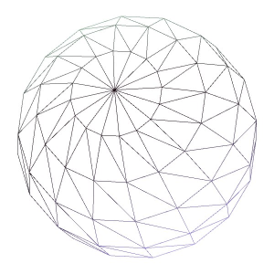
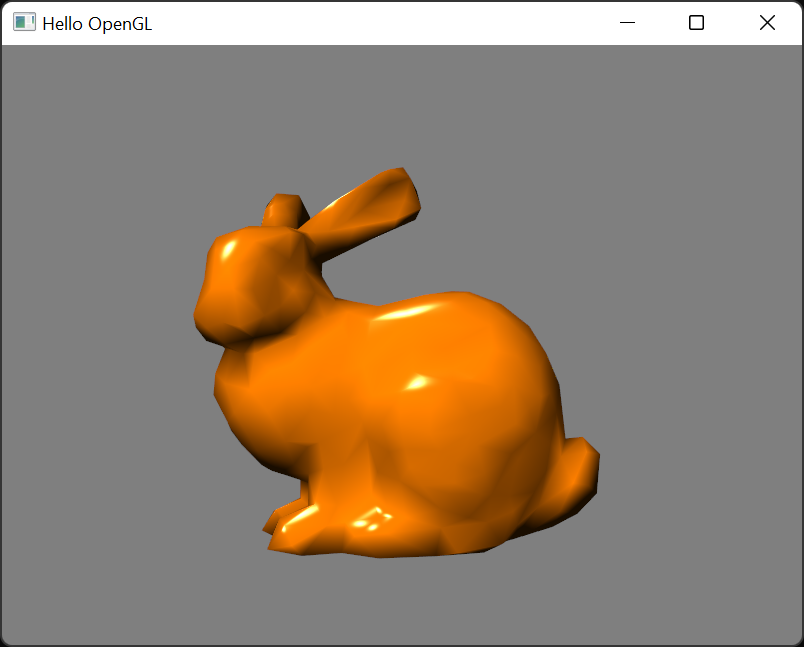

# CS-GY 6533 A / CS-UY 4533 - Interactive Computer Graphics - Fall 2022

# Assignment 3: OpenGL Rendering

Handout date: 10/13/2022

Submission deadline: 10/27/2022, 11:59PM EST

Demo date: TBA, via Zoom appointments

This assignment accounts for 20\% of your final grade. 

## Goals

The goal of this assignment is to implement a OpenGL application that can render different triangle meshes with Phong shading and simple camera controls.

## Submission

*	Follow the link (see discord channel) to create your repository.

*	Add a README.md in markdown format as a report of what you did containing a screenshot for each task

*	Push the code into the repository before deadline

## Tasks

We advise all non-private questions be posted on the class Discord channel, as reference for all students.
For other questions, please email us or join us on the office hours.

### Mandatory Tasks

For each of the tasks below, add at least one image in the readme demonstrating the results (and the intermediate results, if explicitly mentioned).
The code that you used for all tasks has to be provided.
For this assignment, we provide a code framework that uses CMAKE and includes the GLM, GLEW, and GLFW libraries as external resources. For more details, see the lecture slides of chapter 06 (OpenGL Part 2).

### (1) Perspective Projection

Set up the transformation matrices so that the scene is rendered using perspective projection. Use the following parameters:

The camera should be positioned at (0, 0, 5) and look at the point (0, 0, 0). The up direction should be (0, 1, 0) and the field of view in y direction 35°. The near and far values should be 0.1 and 100.0.

*Hint:* You can set the matrices manually, but you are also allowed to use the functions provided by GLM. There is a good tutorial about this at: https://learnopengl.com/Getting-started/Camera

Apply your view and projection matrices in the shader.

### (2) Orbit Camera Controls

The user should be able to control the camera using the WASD and arrow keys. A/D should rotate the camera around the up direction of the scene (i.e., left and right), W/S should rotate around the right direction of the camera (i.e., up and down). The camera should always look at the center of the scene, i.e., towards (0, 0, 0). The up/down keys should move the camera forward/backward (i.e., towards (0,0,0) or away from it). Make sure that the rotation is always with respect to the current viewpoint, e.g., left/right/up/down should be relative to the current camera location. Think about suitable restrictions for the camera movement (the object should always be visible). The R key should reset the camera.

### (3) 3D Objects: Cube

Replace the triangle by a cube with differently colored sides. Each side should be colored uniformly. You can use the colors red (1,0,0), green (0,1,0), blue (0,0,1), yellow (1,1,0), cyan (0,1,1), and magenta (1,0,1). The colors should be passed as vertex attributes to the shader.

*Hint:* Do not forget to enable the depth test and clearing the depth buffer before rendering! 

### (4) 3D Objects: Sphere

Write a routine that creates a unit sphere with arbitrary tessellation. The easiest way is to iterate over the latitude/longitude in small (user-definable) steps of the same angle, thus generating a so-called UV-sphere (see image below). However, other solutions are also accepted. Store the vertices of the sphere in a vertex buffer object (without duplication of vertices) and generate an element buffer for rendering. 

Compute and store the normals of each vertex also in a VBO. The sphere should be colored uniformly orange: (1.0, 0.5, 0.0). Also send the normal to the shader as per-vertex attributes, set them as color and provide a screenshot (to prevent negative color values, you should use the absolute value as color).

### (5) Phong shading (Vertex Shader)

Extend your vertex shader so that it computes Phong shading per vertex (the sphere should again be colored uniformly orange). Use the following parameters: 
Light position: (-1, 2, 3), ambient factor: 0.1, specular color: (1, 1, 1), specular exponent: 50.

### (6) Phong shading (Fragment Shader)

Modify your shaders so that the Phong shading is now computed in the fragment shader. Provide screenshots comparing the per-vertex and per-pixel shading.

### (7) OFF triangle mesh file loading + rendering

The file "data/bunny.off" stores a sample mesh. Write a function that loads OFF files (see Wikipedia for the file format specification: https://en.wikipedia.org/wiki/OFF_(file_format) ). Your loader only has to support triangles (no other polygons or colors). Store the vertex and the vertex ids for triangle rendering. For the Phong shading, you also need per-vertex normals. The normal can be computed by first computing the face normal for each triangle and subsequently summing up the face normals of all triangles that are connected to a vertex (and normalizing the result afterwards).

The bunny model is not centered and quite small. Compute and apply a model matrix that translates the loaded model so that it is centered and uniformly scaled so that it fills a cube of side length 2.0 (i.e., -1.0 to 1.0).

*Hint:* It might be useful to store the min and max vertex coordinate values for each axis during mesh loading.

