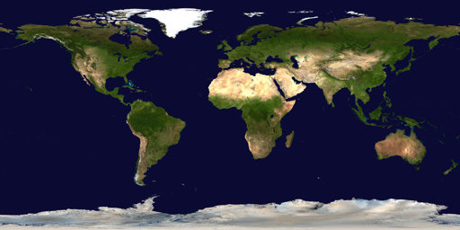

# CS-GY 6533 A / CS-UY 4533 - Interactive Computer Graphics - Fall 2022

# Assignment 4: OpenGL Textures & Deferred Shading

Handout date: 10/27/2022

Submission deadline: 11/10/2022, 11:59PM EST

Demo date: TBA, via Zoom appointments

This assignment accounts for 20\% of your final grade. 

## Goals

The goal of this assignment is to implement a OpenGL application that uses textures for adding details to object surfaces and as render targets (via framebuffer objects). Rendering to textures can not only make the shading computations faster (by using so-called *deferred shading*), but it also makes it possible to add post-processing effects based on the per-pixel values (colors, normals, depth, etc.).

## Submission

*	Follow the link (see discord channel) to create your repository.

*	Add a README.md in markdown format as a report of what you did containing a screenshot for each task

*	Push the code into the repository before deadline

## Tasks

We advise all non-private questions be posted on the class Discord channel, as reference for all students.
For other questions, please email us or join us on the office hours.

**For this assignment, you can either extend your own implementation from assignment 3 or you can use the source code provided in the GitHub classroom!**

### Mandatory Tasks

For each of the tasks below, add at least one image in the readme demonstrating the results (and the intermediate results, if explicitly mentioned).
The code that you used for all tasks has to be provided.
For this assignment, we provide a code framework that uses CMAKE and includes the GLM, GLEW, and GLFW libraries as external resources. For more details, see the lecture slides of chapters 6 (OpenGL Part 2), 7 (Textures), and 8 (Shadows / Framebuffer Objects).

#### (1) Texturing a sphere

Extend the sphere rendering so that the sphere is textured with the provided NASA Blue Marble earth image:

For this, you first have to 

* load the PPM version of the image (you can either use your PPM code from assignment 1 or the provided PPM reader), 
* create a texture and upload the image data,
* compute the texture coordinates for your sphere vertices,
* pass the texture ID and the texture coordinates to your shader, and use them to texture your sphere. *The resulting globe should still be Phong-shaded!*

#### (2) Render-to-Texture

Generate a texture that has the size of the viewport and bind it to a framebuffer object. Render the globe scene to this framebuffer object. After unbinding the framebuffer object, render the texture to a quad, i.e., two triangles forming a rectangle that fills the entire screen.

*Hint:* You will need a second shader programm, i.e., additional vertex/fragment shaders for drawing the textured fullscreen quad/triangles! You can find more information about rendering to a texture and using it here:
http://www.opengl-tutorial.org/intermediate-tutorials/tutorial-14-render-to-texture/ 

#### (3) Deferred Shading

Extend the render-to-texture pipeline from the previous task to implement *Deferred Shading*. The basic idea of deferred shading is to render the color, depth, and normals to three different textures in the first step.
These textures are then used in a second step to calculate the final Phong shading only for the visible pixels (see also: https://en.wikipedia.org/wiki/Deferred_shading). That is, your new shader program for rendering the texture to the screen needs to take care of this.

#### (3) Outlines

Deferred shading can also be used to implement additional effects in screen space. One such effect are depth-dependent outlines. Render the bunny model from the last assignment or the dragon (stanford_dragon2.off) and modify your deferred shading so that it additionally draws black outlines if discontinuities occur in the depth buffer, i.e., if the distance between two objects is above a certain threshold.

### Optional Task

This tasks are optional and worth 3% of the final grade.

#### Depth Darkening

[*Depth Darkening* by Luft et al.](http://graphics.uni-konstanz.de/publikationen/Luft2006ImageEnhancementUnsharp/Luft2006ImageEnhancementUnsharp.pdf) is a simple technique that uses the depth information to simulate an effect similar to *Ambient Occlusion*. 

Ambient Occlusion measures for each point of a surface how much incoming light is obscured from by surrounding geometry. It adds realism by mimicking the effects of indirect light sources (see, e.g., *Tom McReynolds, David Blythe, "Advanced Graphics Programming Using OpenGL", 2005, [Chapter 15](https://www.sciencedirect.com/science/article/pii/B9781558606593500172)* for further information). Ambient Occlusion is a global illumination effect that is costly to compute. However, there are many screen-space approximations that give good results. 

Depth Darkening is one of these methods. The idea is to apply a Gaussian blur the depth buffer and compare the blurred depth values with the original ones. This difference is then used to modulate the amount of ambient light for each pixel in the scene.

The taks is to read the paper by [Luft et al.](http://graphics.uni-konstanz.de/publikationen/Luft2006ImageEnhancementUnsharp/Luft2006ImageEnhancementUnsharp.pdf) and modify your deferred shading to implement Depth Darkening. 

*Hint:* You will need an additional offscreen (i.e., render-to-texture) pass to render and blur your depth buffer from the first rendering pass.